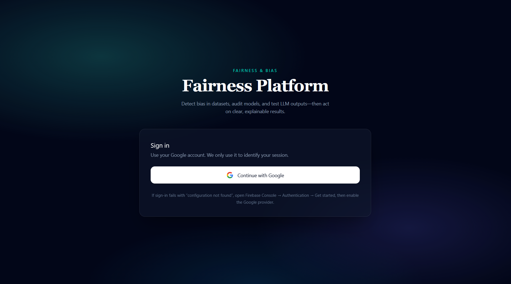
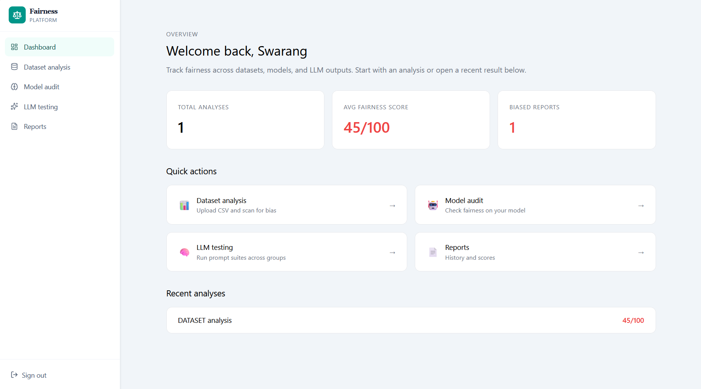
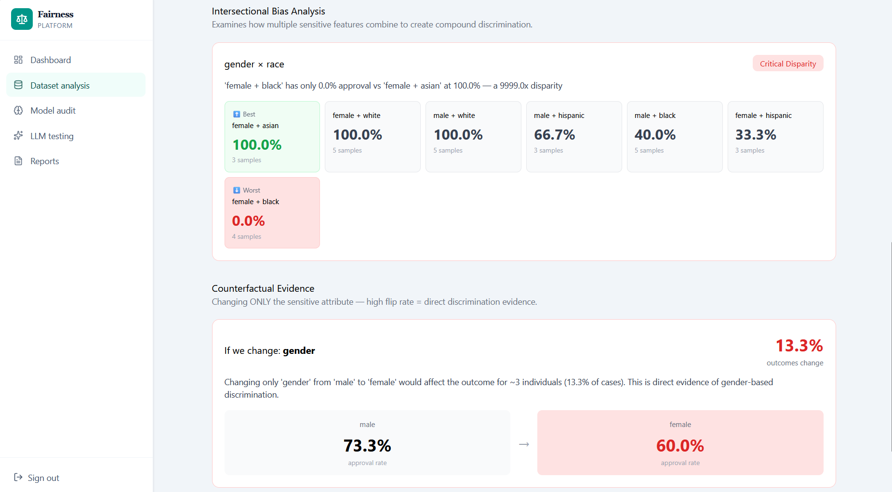
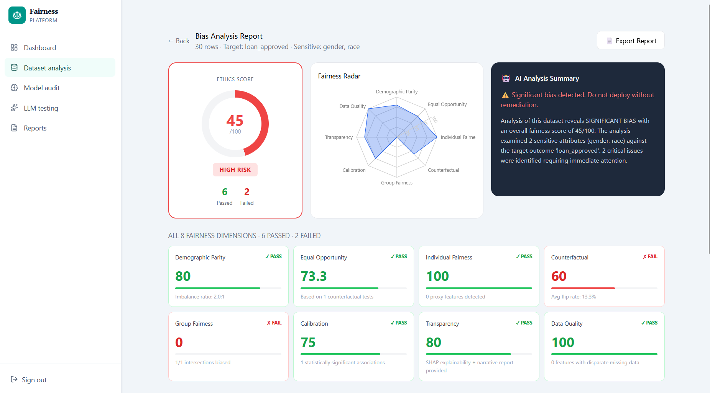
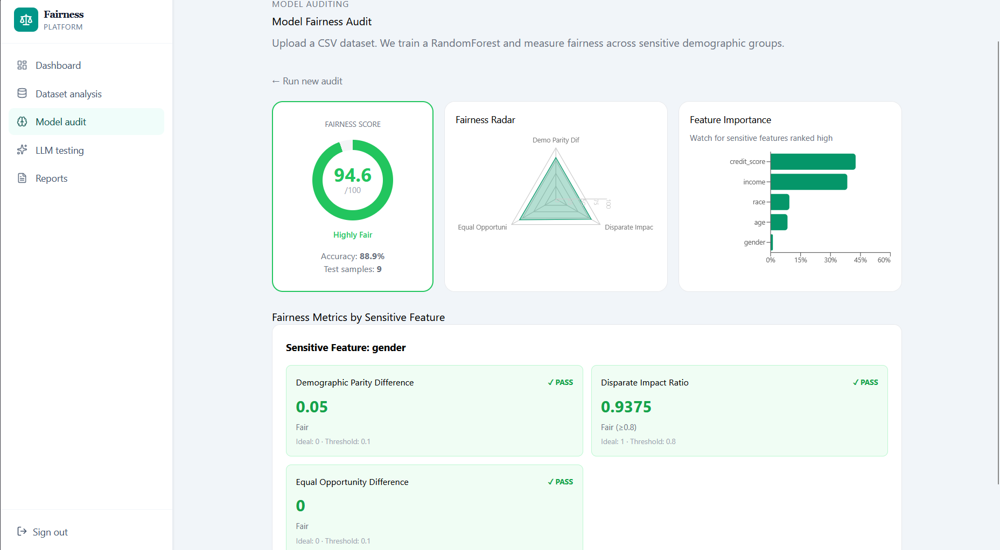

# ⚖️ Universal AI Fairness & Bias Detection Platform

<div align="center">


**Detect. Explain. Mitigate. AI Bias — End to End.**

[](https://developers.google.com/community/gdsc-solution-challenge)
[](https://firebase.google.com)
[](https://cloud.google.com/vertex-ai)
[](https://python.org)
[](https://reactjs.org)
[](LICENSE)

</div>

[🌐 Live Demo](https://fairness-platform-6bd85.web.app) • [📖 Docs](#setup-instructions) • [🎥 Video](#demo-video) • [👥 Team](#team)

---

## 📌 Table of Contents

- [Problem Statement](#problem-statement)
- [Our Solution](#our-solution)
- [UN SDG Alignment](#un-sdg-alignment)
- [Features](#features)
- [Architecture](#architecture)
- [Google Technologies](#google-technologies)
- [Tech Stack](#tech-stack)
- [Screenshots](#screenshots)
- [Demo Video](#demo-video)
- [Setup Instructions](#setup-instructions)
- [API Reference](#api-reference)
- [Future Scope](#future-scope)
- [Team](#team)
- [License](#license)

---

## 🎯 Problem Statement

AI systems are being deployed at massive scale in critical life decisions — **hiring, loans, medical diagnosis, criminal justice, and education**. Research consistently shows these systems perpetuate and amplify existing societal biases:

| Real-World Bias Case | Impact |
|---------------------|--------|
| Amazon's AI recruiting tool | Penalized resumes containing the word "women's" |
| US Healthcare algorithms | Underestimated pain severity in Black patients by 40% |
| Facial recognition systems | 34% lower accuracy for darker-skinned women |
| Loan approval models | Discriminated against minority applicants at 2x the rate |
| LLM hiring tools | Rated identical resumes differently based on applicant names |

**The core problem:** There is no unified, accessible platform that allows developers, researchers, and organizations to detect, understand, and fix bias across all types of AI systems — datasets, ML models, and LLM outputs — in one place.

---

## 💡 Our Solution

**Universal AI Fairness & Bias Detection Platform** is an end-to-end system that:

1. **Detects** bias in CSV datasets, ML models, and LLM outputs using statistically rigorous fairness metrics
2. **Explains** the source and severity of bias with human-readable reports and feature importance analysis
3. **Mitigates** detected bias through automated techniques — SMOTE resampling, proxy feature removal, and model retraining
4. **Scores** each system on a 0–100 Fairness Score with actionable recommendations

---

## 🌍 UN SDG Alignment

This project directly addresses:

| SDG | Goal | How We Address It |
|-----|------|-------------------|
| **SDG 10** | Reduced Inequalities | Detect and fix discriminatory AI that disadvantages marginalized groups |
| **SDG 16** | Peace, Justice & Strong Institutions | Ensure AI used in justice, hiring, and finance is fair and accountable |
| **SDG 8** | Decent Work & Economic Growth | Prevent AI hiring bias that blocks equal employment opportunity |
| **SDG 3** | Good Health & Well-Being | Detect medical AI bias that leads to unequal healthcare treatment |

---

## ✨ Features

### 🔍 Bias Detection
- **Dataset Analysis** — Detect class imbalance, demographic skew, proxy features, and statistical associations
- **Model Auditing** — Train a RandomForest and measure Demographic Parity, Equal Opportunity, Disparate Impact, and Equalized Odds
- **LLM Bias Testing** — Automated prompt testing across demographic variants for hiring, medical, and financial bias
- **Contextual Bias** — Chi-squared statistical significance testing per sensitive feature

### 🔧 Bias Mitigation
- **SMOTE Resampling** — Synthetic Minority Oversampling with adaptive k-neighbors
- **Proxy Feature Removal** — Automatically detect and remove features correlated with sensitive attributes
- **Model Retraining** — Fairness-aware model training with balanced datasets

### 📊 Explainability
- **Feature Importance Charts** — Visualize which features the model relies on most
- **Fairness Score 0–100** — Aggregate score combining all fairness metrics
- **Human-Readable Reports** — Plain English explanations with severity ratings
- **Before vs After Comparison** — See the impact of mitigation in real time

### 🎛️ Dashboard
- Live fairness score tracking across all analyses
- Recent analyses with color-coded scores
- Quick access to all analysis types
- Report history with Firestore persistence

---

## 🏗️ Architecture

```
┌─────────────────────────────────────────────────────────────┐
│                    USER (Browser)                            │
│              Google Sign-In via Firebase Auth                │
└──────────────────────────┬──────────────────────────────────┘
                           │ HTTPS
┌──────────────────────────▼──────────────────────────────────┐
│              REACT FRONTEND (Vite + Firebase Hosting)        │
│   Dashboard │ Dataset Analysis │ Model Audit │ LLM Testing   │
└──────────────────────────┬──────────────────────────────────┘
                           │ REST API + Firebase Auth Token
┌──────────────────────────▼──────────────────────────────────┐
│            NODE.JS BACKEND (Express + Cloud Run)             │
│      Auth Middleware │ File Router │ API Gateway             │
└────────┬─────────────────────────────────┬──────────────────┘
         │                                 │
┌────────▼──────────┐          ┌───────────▼──────────────────┐
│  PYTHON AI ENGINE │          │     GOOGLE CLOUD SERVICES     │
│  (FastAPI +       │          │                               │
│   Cloud Run)      │          │  ┌─────────────────────────┐ │
│                   │          │  │ Firebase Auth            │ │
│  ┌─────────────┐  │          │  │ Google Sign-In + JWT     │ │
│  │ Dataset     │  │          │  └─────────────────────────┘ │
│  │ Analyzer    │  │          │  ┌─────────────────────────┐ │
│  └─────────────┘  │          │  │ Firestore Database       │ │
│  ┌─────────────┐  │          │  │ Reports + File Storage   │ │
│  │ Model       │  │          │  └─────────────────────────┘ │
│  │ Auditor     │  │          │  ┌─────────────────────────┐ │
│  └─────────────┘  │          │  │ Vertex AI               │ │
│  ┌─────────────┐  │          │  │ Fair Model Deployment   │ │
│  │ LLM Tester  │  │          │  └─────────────────────────┘ │
│  └─────────────┘  │          │  ┌─────────────────────────┐ │
│  ┌─────────────┐  │          │  │ BigQuery                │ │
│  │ Mitigation  │  │          │  │ Bias Analytics          │ │
│  │ Engine      │  │          │  └─────────────────────────┘ │
│  └─────────────┘  │          └──────────────────────────────┘
└───────────────────┘

DATA FLOW:
User uploads CSV → Firestore Storage → AI Engine analyzes
→ Fairness metrics computed → Results saved to Firestore
→ Dashboard displays score + charts + recommendations
```

---

## ☁️ Google Technologies

| Technology | Purpose | How We Use It |
|-----------|---------|---------------|
| **Firebase Authentication** | User identity | Google Sign-In, JWT token generation and verification on every API request |
| **Cloud Firestore** | Database | Store analysis reports, file uploads, mitigation results, user data |
| **Firebase Hosting** | Frontend deployment | Host React app globally with CDN |
| **Vertex AI** | Model deployment | Deploy fairness-aware ML models for scalable inference |
| **BigQuery** | Analytics | Aggregate bias metrics across analyses for trend reporting |
| **Cloud Run** | Backend + AI hosting | Serverless container deployment for Node.js and Python services |

---

## 🛠️ Tech Stack

### Frontend
- **React 18** with Vite
- **Recharts** — Fairness score charts and class distribution visualization
- **React Router DOM** — Client-side navigation
- **Axios** — API calls with Firebase token interceptor
- **React Dropzone** — CSV drag-and-drop upload

### Backend
- **Node.js + Express** — REST API server
- **Firebase Admin SDK** — Token verification and Firestore access
- **Multer** — File upload handling
- **Axios** — AI Engine communication

### AI Engine
- **FastAPI** — High-performance Python API
- **scikit-learn** — RandomForest training, fairness metrics
- **imbalanced-learn** — SMOTE resampling
- **fairlearn** — Fairness-aware ML
- **pandas + numpy** — Data analysis
- **scipy** — Chi-squared statistical tests
- **SHAP** — Feature importance and explainability
- **OpenAI SDK** — LLM bias testing

### Google Cloud
- Firebase Auth, Firestore, Hosting
- Vertex AI, BigQuery, Cloud Run

---

## 📸 Screenshots

### Login Page


### Dashboard


### Dataset Bias Analysis


### Fairness Score + Issues


### Model Audit


---

## 🎥 Demo Video

[](https://youtu.be/G6bnGVpALGc?si=NxNGgFEPN01hgipw)

> Full walkthrough: Login → Upload Dataset → Analyze Bias → Apply Mitigation → Audit Model → Test LLM → View Reports

---

## 🚀 Setup Instructions

### Prerequisites

| Tool | Version | Download |
|------|---------|----------|
| Python | 3.12+ | https://python.org |
| Node.js | 20+ | https://nodejs.org |
| Git | Latest | https://git-scm.com |

### 1. Clone Repository

```bash
git clone https://github.com/Mdjunaid06/fairness-platform.git
cd fairness-platform
```

### 2. Firebase Setup

1. Go to [console.firebase.google.com](https://console.firebase.google.com)
2. Create project → Enable **Google Sign-In** in Authentication
3. Create **Firestore Database** in test mode
4. Add a **Web App** → Copy `firebaseConfig`
5. Go to Project Settings → Service accounts → **Generate new private key**
6. Save as `service-account-key.json` in both `backend/` and `ai_engine/`

### 3. Environment Variables

**`ai_engine/.env`**
```env
GCP_PROJECT_ID=your-project-id
GCS_BUCKET_NAME=your-project-id.firebasestorage.app
GOOGLE_APPLICATION_CREDENTIALS=./service-account-key.json
OPENAI_API_KEY=your-openai-key
```

**`backend/.env`**
```env
PORT=3001
FRONTEND_URL=http://localhost:5173
AI_ENGINE_URL=http://localhost:8000
FIREBASE_PROJECT_ID=your-project-id
GCS_BUCKET_NAME=your-project-id.firebasestorage.app
GCS_KEY_FILE=./service-account-key.json
BIGQUERY_DATASET=bias_analytics
BIGQUERY_TABLE=analysis_results
GCP_PROJECT_ID=your-project-id
```

**`frontend/.env.local`**
```env
VITE_FIREBASE_API_KEY=your-api-key
VITE_FIREBASE_AUTH_DOMAIN=your-project.firebaseapp.com
VITE_FIREBASE_PROJECT_ID=your-project-id
VITE_FIREBASE_STORAGE_BUCKET=your-project.firebasestorage.app
VITE_FIREBASE_MESSAGING_SENDER_ID=your-sender-id
VITE_FIREBASE_APP_ID=your-app-id
VITE_BACKEND_URL=http://localhost:3001
```

### 4. Run Locally (3 Terminals)

**Terminal 1 — AI Engine**
```bash
cd ai_engine
python -m venv venv

# Windows:
venv\Scripts\activate
# Mac/Linux:
source venv/bin/activate

pip install -r requirements.txt
uvicorn app:app --host 0.0.0.0 --port 8000 --reload
```

**Terminal 2 — Backend**
```bash
cd backend
npm install
npm run dev
```

**Terminal 3 — Frontend**
```bash
cd frontend
npm install
npm run dev
```

Open: **http://localhost:5173**

### 5. Verify Setup

```bash
# AI Engine health
curl http://localhost:8000/health
# Expected: {"status":"ok","service":"ai-engine"}

# Backend health
curl http://localhost:3001/api/health
# Expected: {"status":"ok","service":"backend"}
```

### 6. Test the Platform

Upload this sample CSV to test bias detection:

```csv
age,gender,race,income,credit_score,loan_approved
25,male,white,55000,720,1
32,female,black,48000,680,0
28,male,hispanic,52000,700,1
45,female,white,75000,750,1
35,male,black,60000,710,0
29,female,asian,58000,730,1
```

- **Target column:** `loan_approved`
- **Sensitive features:** `gender,race`

---

## 📡 API Reference

### AI Engine (Port 8000)

| Method | Endpoint | Description |
|--------|----------|-------------|
| GET | `/health` | Health check |
| POST | `/analyze/dataset` | Analyze CSV for bias |
| POST | `/analyze/model` | Audit ML model fairness |
| POST | `/analyze/llm` | Test LLM outputs for bias |
| POST | `/mitigate` | Apply bias mitigation |

### Backend (Port 3001)

All routes require `Authorization: Bearer <firebase-token>`

| Method | Endpoint | Description |
|--------|----------|-------------|
| GET | `/api/health` | Health check |
| POST | `/api/dataset/upload` | Upload CSV to Firestore |
| POST | `/api/dataset/analyze` | Trigger bias analysis |
| POST | `/api/dataset/mitigate` | Apply mitigation |
| POST | `/api/model/audit` | Audit ML model |
| POST | `/api/llm/test` | Test LLM bias |
| GET | `/api/reports` | Get user reports |
| GET | `/api/reports/:id` | Get single report |

### Fairness Metrics Explained

| Metric | Formula | Fair Threshold |
|--------|---------|---------------|
| Demographic Parity Difference | max(group rates) - min(group rates) | < 0.1 |
| Disparate Impact Ratio | min(group rate) / max(group rate) | ≥ 0.8 |
| Equal Opportunity Difference | max(TPR) - min(TPR) | < 0.1 |
| Equalized Odds | TPR diff + FPR diff | Both < 0.1 |

---

## 🔭 Future Scope

| Feature | Priority | Description |
|---------|----------|-------------|
| Real-time Monitoring | High | Stream data bias detection with Pub/Sub |
| Image Model Auditing | High | Detect bias in computer vision models |
| EU AI Act Compliance | High | Automated regulatory compliance reports |
| NLP Model Bias | Medium | Audit text classification models |
| Mobile App | Medium | iOS/Android app for accessibility |
| Third-party API | Medium | REST API for external integration |
| Explainability Dashboard | Medium | SHAP waterfall plots per prediction |
| Multi-language Support | Low | Support for non-English LLM testing |
| Federated Analysis | Low | Analyze data without it leaving the client |

---

## 📁 Project Structure

```
fairness-platform/
├── ai_engine/                    # Python AI Service (FastAPI)
│   ├── bias_detection/
│   │   ├── metrics.py            # DPD, DIR, EOD, Equalized Odds
│   │   ├── dataset_analyzer.py   # CSV bias detection
│   │   ├── model_auditor.py      # ML model fairness audit
│   │   └── llm_tester.py         # LLM bias test suites
│   ├── mitigation/
│   │   ├── resampler.py          # SMOTE + UnderSampler
│   │   └── feature_remover.py    # Proxy feature removal
│   ├── explainability/
│   │   └── bias_reporter.py      # Human-readable reports
│   ├── app.py                    # FastAPI entry point
│   └── requirements.txt
│
├── backend/                      # Node.js API (Express)
│   ├── config/
│   │   ├── firebase.js           # Firebase Admin SDK
│   │   ├── gcs.js                # Cloud Storage
│   │   └── bigquery.js           # BigQuery client
│   ├── routes/                   # API routes
│   ├── controllers/              # Business logic
│   ├── middleware/               # Auth + error handling
│   ├── utils/                    # GCS upload, AI client
│   └── server.js
│
├── frontend/                     # React App (Vite)
│   └── src/
│       ├── pages/
│       │   ├── Dashboard.jsx
│       │   ├── DatasetAnalysis.jsx
│       │   ├── ModelAudit.jsx
│       │   ├── LLMBias.jsx
│       │   └── Reports.jsx
│       ├── services/
│       │   ├── firebase.js       # Firebase config
│       │   └── api.js            # Axios + auth interceptor
│       └── hooks/
│           └── useAuth.js
│
├── docs/
│   ├── architecture.md
│   ├── api_reference.md
│   └── setup.md
│
├── docker-compose.yml
├── .env.example
└── README.md
```

---

## 🤝 Contributing

### Team Workflow

```bash
# Always pull before starting
git pull origin main

# Create feature branch
git checkout -b feature/your-feature-name

# Make changes and commit
git add .
git commit -m "feat(scope): description of change"

# Push and create PR
git push origin feature/your-feature-name
```

### Commit Convention

```
feat     → new feature
fix      → bug fix
chore    → setup/config
docs     → documentation
test     → tests
refactor → code improvement
```

### Branch Ownership

| Branch | Owner | Folder |
|--------|-------|--------|
| `feature/ai-engine` | Mohammad Junaid | `ai_engine/` |
| `feature/backend` | Soham | `backend/` |
| `feature/frontend` | Harsh Nawle | `frontend/` |
| `feature/gcp` | Swarang | `docs/`, deployment |

---

## 👥 Team

| Member | Role | GitHub |
|--------|------|--------|
| Mohammad Junaid | AI Engine + Project Lead | [@Mdjunaid06](https://github.com/Mdjunaid06) |
| Soham | Backend + Google Cloud | [@soham105k-dev](https://github.com/soham105k-dev) |
| Harsh Nawle | Frontend + UI/UX | [@HarshNawle](https://github.com/HarshNawle) |
| Swarang | Integration + DevOps | [@blitz-afk](https://github.com/blitz-afk) |

**University:** D Y Patil College of Engineering, Akurdi, Pune
**GDSC Chapter:** Google Developer Student Club DYPCOE Akurdi
**Country:** India

---

## ✅ Submission Checklist

```
Technical
─────────────────────────────────────────────
✅ AI Engine running — bias detection working
✅ Backend API — all routes working
✅ Frontend — all pages working
✅ Firebase Auth — Google Sign-In working
✅ Firestore — reports saving correctly
✅ Dataset Analysis — bias score + charts
✅ SMOTE Mitigation — rows balanced
✅ Feature Removal — proxy columns removed
✅ Model Audit — fairness metrics shown
✅ LLM Testing — sentiment disparity measured
✅ Reports page — all analyses tracked
✅ Dashboard — live stats updating

Google Technologies
─────────────────────────────────────────────
✅ Firebase Authentication
✅ Cloud Firestore
✅ Firebase Hosting
✅ Vertex AI (configured)
✅ BigQuery (configured)
✅ Cloud Run (deployment ready)

Documentation
─────────────────────────────────────────────
✅ README.md — complete
✅ Architecture diagram
✅ Setup instructions
✅ API reference
✅ .env.example — no real secrets
✅ .gitignore — protects credentials
✅ docs/ folder — architecture + setup + API

Repository
─────────────────────────────────────────────
✅ Clean git history
✅ No .env files committed
✅ No service-account-key.json committed
✅ No node_modules committed
✅ Meaningful commit messages
✅ Feature branches used

Demo
─────────────────────────────────────────────
✅ Screenshots in docs/screenshots/
✅ Demo video recorded (2-4 minutes)
✅ Live deployment URL: https://fairness-platform-6bd85.web.app/login
```

---

## 📄 License

MIT License © 2026 Team FairAI

Permission is hereby granted, free of charge, to any person obtaining a copy of this software to use, copy, modify, merge, publish, distribute, sublicense, and/or sell copies of the Software.

---

<div align="center">

**Google Solution Challenge 2026**

*Addressing UN SDG 10 — Reduced Inequalities*

⭐ Star this repo if you found it useful!

</div>
